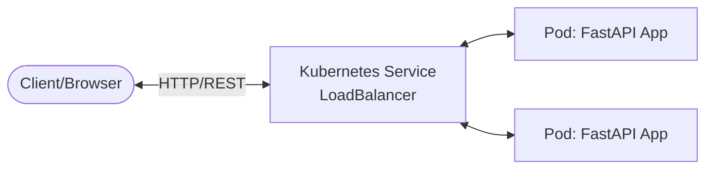
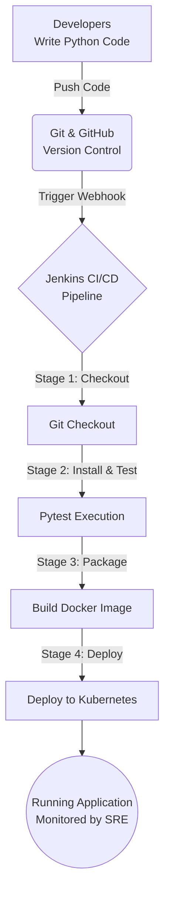

# Project Architecture & DevOps Lifecycle

## 1. High-Level System Architecture

The application is a stateless REST API built with Python and FastAPI. It receives HTTP requests, processes student data, and returns JSON responses.

## 2. CI/CD DevOps Pipeline Architecture

