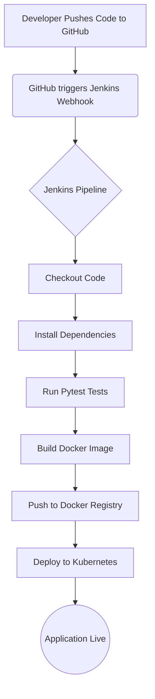

# Project Architecture

## High-Level Architecture

The DevOps Student Management application is built using Python FastAPI for the backend. It consists of multiple modules mounted on a central `main.py`.

- **Authentication Module:** Handles user login and JWT token generation.
- **Registration Module:** Handles student registration.
- **Core CRUD API:** Handles viewing, updating, and deleting student records.

The application is containerized using Docker and deployed using Kubernetes.

## CI/CD Pipeline

The Continuous Integration and Continuous Deployment pipeline is managed by Jenkins.

